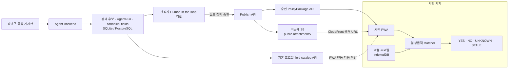
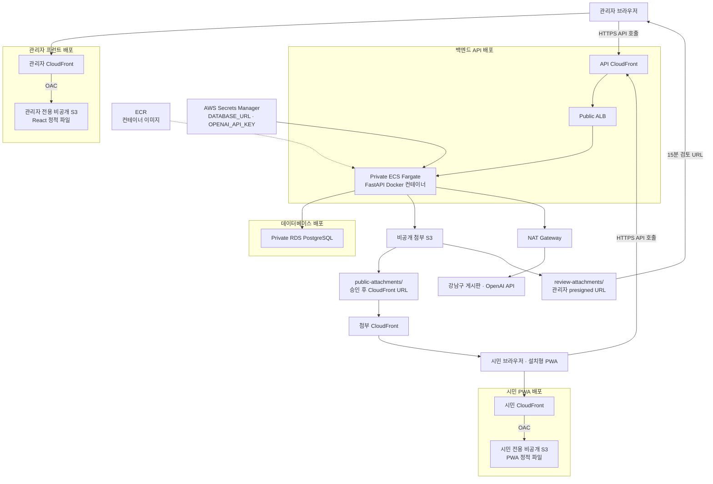
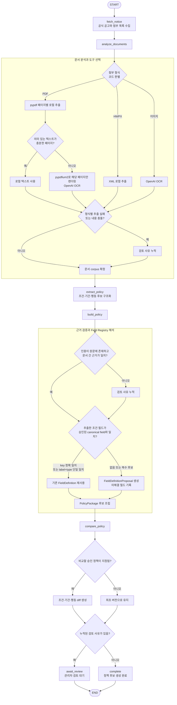

# Gangnam Change Agent

> 강남의 정책·생활 변화를 근거와 함께 분석하고, 시민 개인정보를 서버로 보내지 않은 채 나에게 미치는 영향과 받을 수 있는 혜택, 해야 할 일을 알려주는 Change Agent입니다.

Gangnam Change Agent는 강남구청 공고와 첨부문서를 분석해 조건, 변경점, 신청 기간과 행동 항목을 `PolicyPackage`로 만듭니다. Agent 결과는 관리자의 Human-in-the-loop 검토를 통과한 뒤 공개되고, 시민 PWA는 기기 안의 프로필로 `YES / NO / UNKNOWN / STALE`을 결정론적으로 판정합니다.

## 배포 주소

- **관리자 웹**: [https://d25mh7hdavvr2k.cloudfront.net/](https://d25mh7hdavvr2k.cloudfront.net/)
- **시민 PWA**: [https://d30pysa0iyz6g5.cloudfront.net/](https://d30pysa0iyz6g5.cloudfront.net/)
- **Backend API**: [https://d25409t9vvq1vj.cloudfront.net/](https://d25409t9vvq1vj.cloudfront.net/)

세 애플리케이션은 하나의 서버에 묶지 않고 독립적으로 배포했습니다. 시민 PWA와 관리자 웹은 각각 별도의 비공개 S3 버킷에 빌드 결과를 저장하고 각자의 CloudFront로 제공합니다. FastAPI 백엔드는 Docker 이미지로 빌드해 ECS Fargate에서 실행하고 API 전용 CloudFront를 통해 공개합니다. 프런트는 이 API를 호출하며, 영속 데이터는 애플리케이션과 분리된 RDS PostgreSQL에 저장합니다.

## 왜 필요한가요?

강남의 혜택, 정책, 교통과 공사 정보는 여러 게시판과 공고에 흩어져 있고 같은 사업도 조건과 기간이 계속 바뀝니다. 공고를 한곳에 모아 보여주더라도 시민은 각 내용을 읽고 자신과 관계있는지 직접 판단해야 합니다.

개인에게 맞는 정보를 제공하려면 나이, 거주지와 같은 조건을 알아야 하지만 처음부터 모든 정보를 입력받기는 어렵습니다. 고정된 프로필 항목만 사용하면 새로운 정책 조건이 등장했을 때 필요한 정보가 없어 관련 정책을 놓칠 수도 있습니다.

Gangnam Change Agent는 공고에서 판정에 필요한 조건을 동적으로 만들고, 시민이 아직 입력하지 않은 조건만 추가로 질문합니다. 답변은 기기에 저장되며 즉시 다시 판정되어 변화가 나에게 미치는 영향과 해야 할 일을 보여줍니다.

개인화 서비스를 위해 시민 정보를 중앙 서버에 모으면 서버 침해 한 번으로 많은 사용자의 정보가 함께 노출될 수 있습니다. Gangnam Change Agent는 공개 정책 데이터만 서버에서 관리하고 개인 프로필과 판정 결과는 각 사용자의 기기에 분리해 저장하여, 중앙 서버 침해로 인한 대규모 개인정보 유출 위험을 줄입니다.

이 프로젝트는 강남의 변화가 시민 개인에게 어떤 의미인지 답합니다.

- 강남의 새로운 정책과 생활 변화가 나에게 어떤 영향을 주는가?
- 지금 내 조건으로 받을 수 있는 혜택은 무엇인가?
- 이전 공고에서 바뀐 조건과 기간이 내 자격과 해야 할 일을 어떻게 바꾸는가?
- 주변 공사와 교통 변화가 내가 이용하는 정류장과 일상에 어떤 영향을 주는가?

## 핵심 특징

- **다중 형식 교차 검증**: Scrapling으로 공식 공고를 수집하고 HTML, PDF, HWPX, 이미지의 추출 결과를 서로 비교해 누락과 오분석을 발견하고 정확도를 높입니다.
- **상태 기반 Agent 의사결정**: LangGraph Agent가 수집·분석·추출·비교 결과와 검토 사유를 상태로 누적하고, 다음 처리 단계와 관리자 검토 또는 완료 경로를 결정합니다.
- **코드 기반 OCR 분기**: PDF를 페이지별로 로컬 추출한 뒤 코드가 텍스트 충분 여부를 판정하고, 부족한 스캔 페이지만 OpenAI OCR로 보냅니다.
- **변화와 근거의 구조화**: 이전 승인 정책과 비교한 조건·기간·행동의 변경점에 원문 근거를 연결합니다.
- **Human-in-the-loop 공개**: 추출 실패, 근거 충돌과 신규 필드를 관리자가 검토하며 승인된 정책만 공개합니다.
- **동적 로컬 프로필**: 기본정보는 승인된 canonical field catalog로 제공하고, 새 조건은 `FieldDefinitionProposal`로 제안해 승인된 질문만 시민 기기에 추가합니다. 질문에는 판정 시점과 지역 같은 문맥을 포함하며 enum 선택지도 관리자가 수정·승인할 수 있습니다.
- **개인정보 비전송**: 시민 프로필과 개인별 판정 결과는 IndexedDB에만 저장하고 서버 API, 로그와 URL에 보내지 않습니다.

## 현재 구현 상태

| 영역 | 현재 상태 |
|---|---|
| Agent Backend | 공식 공고 수집, 다중 형식 분석, OCR, 이전 공고 diff, PolicyPackage·AgentRun, 검토·공개 API와 기본 프로필 catalog 구현 |
| 시민 PWA | IndexedDB 프로필, 결정론적 matcher, UNKNOWN/STALE 추가 질문과 승인 정책 API adapter 구현. CloudFront 배포 완료. 기본 프로필 catalog API 연동은 다음 작업 |
| 관리자 웹 | 검토 UI, 실행 로그, 수동 새 공고 확인, 질문·enum 선택지 수정 승인 구현. CloudFront 배포 완료 |
| AWS | 시민 PWA·관리자 웹은 각각 별도 비공개 S3와 CloudFront, 백엔드는 Docker·ECR·private ECS Fargate와 API CloudFront, DB는 별도 private RDS PostgreSQL로 분리 배포 |

백엔드는 87개 테스트를 통과했습니다. 시민 PWA는 9개 matcher 테스트와 production build, 관리자 웹은 production build를 통과한 상태를 기준으로 작성했습니다.

## 전체 아키텍처



관리자 웹, 시민 PWA, 백엔드 API와 데이터베이스는 서로 다른 배포 단위입니다. 사용자는 각 프런트의 CloudFront 주소로 접속하고, 브라우저에서 API 전용 CloudFront를 호출합니다. S3 버킷 자체는 공개하지 않으며, 승인된 근거 첨부만 `public-attachments/`에 저장하고 `PUBLIC_ATTACHMENT_BASE_URL`의 첨부 CloudFront 주소로 공개 URL을 만듭니다. 시민 프로필과 개인별 판정 결과는 중앙 서버로 전송하지 않습니다.

### AWS 배포 구성

<details>
<summary>CloudFront, ECS, RDS와 S3 연결 구조 보기</summary>



인프라는 Terraform으로 관리하며 Git push 자동 배포는 사용하지 않습니다. 프론트엔드는 build 후 S3 업로드와 CloudFront 무효화, 백엔드는 Docker build 후 ECR push와 ECS rolling deployment가 필요합니다. 백엔드는 승인 전 원본을 비공개 `review-attachments/`에 저장해 관리자에게 15분 presigned URL을 제공하고, 최종 승인된 근거만 `public-attachments/`에 archive해 CloudFront 고정 URL로 공개합니다. 최신 변경의 배포 환경 통합 smoke는 남아 있습니다.

</details>

## 개인정보 원칙

서버가 다루는 정보:

- 강남구 공식 공개 공고와 첨부
- 정책 패키지 후보와 승인 상태
- 시민 정보가 포함되지 않은 Agent 실행·검토 로그

시민 기기에만 남는 정보:

- 나이, 거주, 고용, 소득, 가구, 건강·장애 등 로컬 프로필
- 개인별 정책 판정 결과
- 즐겨찾기와 숨긴 정책 상태

시민 프로필은 IndexedDB에만 저장하며 서버 요청, 실행 로그와 URL에 포함하지 않습니다. 완벽한 보안을 주장하는 것이 아니라 개인정보를 중앙 서버에 모으지 않는 데이터 최소화 설계입니다.

## LangGraph와 노드 내부 처리 흐름

[`backend/app/agent/graph.py`](backend/app/agent/graph.py)의 실제 노드 연결과 각 노드가 수행하는 핵심 판단을 함께 표시했습니다. 첨부 형식 선택과 Field Registry 해석은 별도 LangGraph 노드가 아니라 각각 `analyze_documents`, `build_policy` 안에서 실행되는 로직입니다. 텍스트 PDF와 스캔 PDF도 LLM이 구분하지 않습니다. 로컬 코드가 페이지별 추출 결과를 검사해 의미 있는 텍스트가 부족한 페이지만 OCR 대상으로 정합니다.

<details>
<summary>상세 노드와 내부 분기 보기</summary>



모든 단계는 `AgentRun.node_logs`에 실행 상태를 남깁니다. 각 처리 단계에서 예외가 발생하면 `fail`로 종료하며 실패 노드와 원인을 기록합니다. 자동 복구 이후에도 문제가 남으면 결과를 임의로 공개하지 않고 `review_required`, `review_reason`, `unresolved_fields`로 관리자에게 전달합니다.

</details>

## 목표 데모 흐름

1. 관리자가 **새 공고 확인**을 눌러 강남구 공식 게시판의 미처리 URL을 확인합니다.
2. Agent가 본문과 첨부를 분석하고 정책 후보, 변경점, 근거와 실행 로그를 저장합니다.
3. 관리자가 신규 필드와 근거를 검토해 승인·수정·반려합니다.
4. 모든 필드 검토가 승인된 정책만 최종 승인해 시민 API에 공개합니다.
5. 시민 PWA가 승인 정책을 가져와 기기 안의 프로필로 판정합니다.
6. 정보가 부족하면 질문하고, 오래된 정보가 있으면 먼저 갱신을 요청한 뒤 즉시 재판정합니다.

> 현재 새 공고 확인은 관리자 수동 실행 방식입니다. AWS의 프론트엔드·백엔드 기본 배포와 API 연결은 확인했지만, 최신 profile catalog와 enum 검토 변경까지 포함한 수집 → 검토 → 승인 → 시민 반영 전체 smoke는 남아 있습니다. 주기 스케줄러와 실시간 푸시는 포함하지 않습니다.

## 기술 스택

**Agent & Backend**

[](https://docs.python.org/3.11/)
[](https://fastapi.tiangolo.com/)
[](https://github.com/langchain-ai/langgraph)
[](https://docs.pydantic.dev/)
[](https://github.com/D4Vinci/Scrapling)
[](https://platform.openai.com/docs/)

**Frontend & PWA**

[](https://react.dev/)
[](https://www.typescriptlang.org/)
[](https://vite.dev/)
[](https://developer.mozilla.org/docs/Web/Progressive_web_apps)

**Data & Infrastructure**

[](https://www.sqlalchemy.org/)
[](https://www.sqlite.org/)
[](https://aws.amazon.com/rds/postgresql/)
[](https://www.docker.com/)
[](https://www.terraform.io/)
[](https://aws.amazon.com/fargate/)
[](https://aws.amazon.com/ecr/)
[](https://aws.amazon.com/cloudfront/)
[](https://aws.amazon.com/s3/)
[](https://aws.amazon.com/secrets-manager/)

### 기술 선택 이유

<details>
<summary>기술별 선택 이유 보기</summary>

| 기술 | 선택 이유 |
|---|---|
| Python · FastAPI · Pydantic | 문서 처리와 AI 생태계를 활용하면서 API 입출력을 타입과 schema로 검증하기 위해 사용했습니다. |
| LangGraph | 수집부터 검토 분기까지의 상태, 실패 경로와 실행 로그를 명시적인 그래프로 관리하기 위해 사용했습니다. |
| Scrapling Fetcher | 브라우저 Spider 없이 강남구 공식 정적 HTML을 가볍게 수집하기 위해 사용했습니다. |
| pypdf · pypdfium2 · HWPX XML | 텍스트 문서는 로컬에서 먼저 처리해 OCR 비용과 지연을 줄이고 원문 형식을 교차 검증하기 위해 사용했습니다. |
| OpenAI Responses API | 공개 공고의 구조화 정책 추출과 로컬 처리가 불가능한 이미지·스캔 PDF OCR에만 제한적으로 사용했습니다. |
| React · TypeScript · Vite | 시민 PWA와 관리자 웹을 빠르게 개발하면서 공통 계약의 타입 오류를 빌드 시점에 확인하기 위해 사용했습니다. |
| IndexedDB · Service Worker | 시민 프로필을 서버로 보내지 않고 기기에 저장하며 설치 가능한 PWA 경험을 제공하기 위해 사용했습니다. |
| SQLAlchemy · SQLite · RDS PostgreSQL | 같은 저장소 계층으로 로컬은 SQLite를 사용하고 배포 환경은 private RDS PostgreSQL로 전환하기 위해 사용했습니다. |
| Docker · ECR · ECS Fargate | FastAPI 실행 환경을 컨테이너로 고정하고 이미지를 ECR에 저장한 뒤 private ECS에서 rolling deployment하기 위해 사용했습니다. |
| CloudFront · 비공개 S3 · OAC | 관리자와 시민 프론트 정적 파일을 비공개 버킷에 두고 CloudFront를 통해서만 제공하기 위해 사용했습니다. |
| CloudFront · Public ALB | 외부 HTTPS 요청을 받아 private ECS Fargate의 FastAPI 컨테이너로 전달하기 위해 사용했습니다. |
| Amazon S3 | 승인 전 공식 첨부는 비공개 `review-attachments/`에 보관해 관리자에게 단기 presigned URL로 제공하고, 승인된 공개 근거만 `public-attachments/`에 archive해 CloudFront 고정 URL로 제공하기 위해 사용했습니다. |
| AWS Secrets Manager | `DATABASE_URL`과 `OPENAI_API_KEY`를 이미지와 저장소 밖에서 런타임에 주입하기 위해 사용했습니다. |
| Terraform | CloudFront, S3, 네트워크, ECS, RDS와 관련 IAM 구성을 같은 코드로 관리하기 위해 사용했습니다. |

</details>

## 저장소 구조

```text
backend/                  FastAPI, LangGraph, 수집·분석·검토·Publish
frontend/citizen/         설치 가능한 시민 PWA와 로컬 판정
frontend/admin/           관리자 검토·승인 브라우저 앱
docs/contracts/           API와 JSON Schema 공통 계약
docs/worklogs/            담당별 현재 상태와 다음 작업
docs/deployment/           백엔드·AWS 배포 인계 문서
demo-data/                계약 검증과 데모용 fixture
```

## 로컬 실행

<details>
<summary>설치 및 로컬 실행 명령 보기</summary>

### 준비 사항

- Python 3.11 이상
- Node.js 20.19 이상
- OpenAI API key: 실제 공고의 정책 구조화와 이미지·스캔 PDF OCR 실행 시에만 필요

저장소 루트에서 환경 파일을 만듭니다.

```powershell
Copy-Item .env.example .env
```

실제 Agent를 실행하려면 `.env`의 `OPENAI_API_KEY`에 로컬 키를 입력합니다. 프론트엔드 fixture 데모와 일반 build에는 키가 필요하지 않습니다. `.env`와 실제 secret은 Git에 커밋하지 않습니다.

### 1. Backend

```powershell
cd backend
python -m venv .venv
.\.venv\Scripts\Activate.ps1
python -m pip install -e ".[dev]"
python -m uvicorn app.main:app --reload --env-file ../.env
```

- API: <http://localhost:8000>
- Health check: <http://localhost:8000/health>
- OpenAPI: <http://localhost:8000/docs>

기본 DB는 로컬 SQLite입니다. 배포 환경에서는 `DATABASE_URL`로 PostgreSQL을 연결합니다.

### 2. 시민 PWA

새 PowerShell에서 실행합니다.

```powershell
cd frontend/citizen
npm.cmd install
npm.cmd run dev
```

- 시민 PWA: <http://localhost:5173>

### 3. 관리자 앱

새 PowerShell에서 실행합니다.

```powershell
cd frontend/admin
npm.cmd install
npm.cmd run dev
```

- 관리자 앱: <http://localhost:5174>

두 프론트는 로컬에서 기본적으로 `http://localhost:8000`을 사용합니다. `127.0.0.1`은 다른 CORS origin이므로 README의 `localhost` 주소로 접속하세요. 다른 API를 사용할 때는 각 프론트의 `.env.local`에 다음 값을 설정하고 다시 빌드합니다.

```env
VITE_API_BASE_URL=https://your-api.example.com
```

배포 시 백엔드에는 관리자와 시민 프론트의 정확한 HTTPS origin을 쉼표로 구분해 설정합니다.

```env
BACKEND_CORS_ORIGINS=https://d25mh7hdavvr2k.cloudfront.net,https://d30pysa0iyz6g5.cloudfront.net
```

</details>

## 검증

```powershell
# Backend
cd backend
python -m pytest

# Citizen PWA
cd frontend/citizen
npm.cmd test
npm.cmd run build

# Admin
cd frontend/admin
npm.cmd run build
```

JSON Schema와 fixture는 백엔드 테스트에서 실제 `$ref` 해결과 재귀 EligibilityRule을 포함해 검증합니다. 저장소 개발 환경에 Ruff가 설치되어 있다면 `python -m ruff check app tests`와 `python -m ruff format --check app tests`도 실행합니다.

## 주요 API

<details>
<summary>주요 API 목록 보기</summary>

| Method | Path | 용도 |
|---|---|---|
| `GET` | `/health` | 백엔드 상태 확인 |
| `GET` | `/api/profile-fields` | PWA 기본·선택 온보딩용 승인 canonical field 조회 |
| `POST` | `/api/notice-discovery-runs` | 공식 게시판에서 미처리 공고 확인·실행 |
| `POST` | `/api/agent-runs` | 지정한 공식 공고 Agent 실행 |
| `GET` | `/api/agent-runs` | 관리자 실행 목록 조회 |
| `GET` | `/api/admin/agent-runs/{run_id}` | 실행·정책·필드 검토 묶음 조회 |
| `POST` | `/api/field-definition-reviews/{review_id}/approve` | 신규 필드 승인 또는 수정 승인 |
| `POST` | `/api/policy-packages/{policy_id}/approve` | 정책 최종 승인·공개 |
| `GET` | `/api/policy-packages` | 시민용 승인 정책 목록 조회 |

전체 요청·응답과 상태 전이는 [`docs/contracts/api.md`](docs/contracts/api.md)를 확인하세요.

</details>

## 판정 상태

| 상태 | 의미 |
|---|---|
| `YES` | 현재 기기 정보로 조건 충족 |
| `NO` | 현재 기기 정보로 조건 불충족 |
| `UNKNOWN` | 판정에 필요한 정보가 없어 추가 질문 필요 |
| `STALE` | 저장된 정보가 오래되어 갱신 질문 필요 |

판정은 `equals`, `in`, `between`, `contains`, `exists`와 재귀 `AND / OR`만 사용하며 LLM이 시민 자격을 결정하지 않습니다. `STALE` 갱신 질문을 먼저 처리한 뒤 `UNKNOWN` 신규 질문을 선택합니다.

## 문제 해결 과정

<details>
<summary>개발 중 시행착오와 해결 과정 보기</summary>

### PR 대상 브랜치를 잘못 선택한 문제

Agent Backend의 일부 작업을 해당 기능 브랜치에 병합해야 했지만 PR의 대상 브랜치를 잘못 선택해 `main`에 병합했습니다. 팀 검토에서도 대상 브랜치 오류를 놓쳤고, 병합 후 이를 발견해 `main`을 안정 상태로 되돌렸습니다. 이후 PR을 병합하기 전에 base와 compare 브랜치, 변경 범위와 계약 소비자를 함께 확인하도록 절차를 고쳤습니다.

### 스캔 PDF의 배포 서버 연산 부담

스캔 PDF 전체를 배포 서버에서 OCR하면 CPU·메모리와 처리 시간이 커집니다. 페이지별 로컬 텍스트 추출을 먼저 수행하고 의미 있는 텍스트가 없는 페이지만 이미지로 렌더링해 OpenAI OCR로 보내도록 바꿨습니다. 텍스트 문서는 로컬에서 처리하고, 외부 모델에는 시민 정보가 아닌 공개 공고의 필요한 페이지만 전달합니다.

### CORS로 실제 공고 API를 호출하지 못한 문제

관리자 화면은 `http://127.0.0.1:5174`, 백엔드 허용 origin은 `http://localhost:5174`여서 `Failed to fetch`가 발생했습니다. 로컬 호스트명을 통일하고, 배포 시 `VITE_API_BASE_URL`과 `BACKEND_CORS_ORIGINS`를 함께 확인하도록 정리했습니다. 같은 컴퓨터에서도 hostname, scheme, port가 다르면 별도 origin입니다.

### AWS Secrets Manager에서 API key를 읽지 못한 문제

배포 환경은 Secrets Manager 값을 JSON 객체로 읽는데 secret을 평문 문자열로 저장해 애플리케이션이 `OPENAI_API_KEY`를 찾지 못했습니다. AWS 문서와 실행 로그를 대조해 secret 값을 실제 키 이름을 가진 JSON 구조로 저장하도록 수정했습니다.

```json
{
  "DATABASE_URL": "postgresql+psycopg://...",
  "OPENAI_API_KEY": "your-secret-value"
}
```

실제 값은 코드, Terraform 변수 파일과 로그에 남기지 않았습니다. secret 저장 형식과 애플리케이션의 읽기 방식이 일치하는지도 배포 검증 항목에 포함했습니다.

</details>

## 현재 범위와 제한

- 새 공고 확인은 관리자 버튼으로 실행하며 주기 크롤링은 구현하지 않았습니다.
- 새 공고와 기존 정책을 자동으로 연결하지는 않습니다. Agent 실행 시 비교할 기존 승인 정책을 지정하면 조건·기간·행동의 변경점을 생성합니다.
- 이미 열린 시민 PWA로 정책을 실시간 push하지 않습니다. 앱 실행 또는 새로고침 시 승인 정책을 다시 가져옵니다.
- Git push 기반 자동 배포는 구현하지 않았습니다. 프론트엔드는 build·S3 upload·CloudFront 무효화, 백엔드는 Docker build·ECR push·ECS rolling deployment를 수동으로 수행합니다.
- STALE 갱신 주기는 필드별 `validity_days`로 설정되며, 관리자가 화면에서 이 값을 수정하는 기능은 추후 고도화 과제로 남겼습니다.
- PWA의 기본 프로필 catalog API 소비, `잘 모르겠어요` 선택 시 값을 저장하지 않고 `UNKNOWN`을 유지하는 동작, 자주 쓰는 정류장 목록 입력은 최신 백엔드 계약에 맞춘 다음 연동 작업입니다.
- Agent의 Field Registry는 기존 canonical field 재사용과 중복 제안 방지를 처리합니다. 다만 공고가 많아지면 정책별 미입력 조건 질문이 여러 카드에 나타날 수 있으므로, 여러 정책을 가장 많이 판정할 수 있는 질문부터 한 번에 하나씩 보여주는 PWA 전역 질문 우선순위 큐는 추후 고도화 과제로 남겼습니다.
- 과거 공고에는 HWP 첨부가 있지만 현재 수집 대상은 대부분 HWPX를 사용합니다. [정부의 개방형 행정문서 전환 방향](https://www.mois.go.kr/frt/bbs/type010/commonSelectBoardArticle.do?bbsId=BBSMSTR_000000000008&nttId=125938)과 해커톤 범위를 고려해 HWPX XML 파서를 우선 구현했으며, 바이너리 HWP 파서는 과거 공고 비교 범위를 확대할 때 재검토합니다.

## 문서와 협업

- 제품과 개인정보 경계: [`docs/PROJECT_CONTEXT.md`](docs/PROJECT_CONTEXT.md)
- 설계 결정: [`docs/DECISIONS.md`](docs/DECISIONS.md)
- 공통 계약: [`docs/contracts/`](docs/contracts/)
- 협업 절차: [`docs/TEAM_CODEX_SYNC_CONTEXT.md`](docs/TEAM_CODEX_SYNC_CONTEXT.md)
- 담당별 상태: [`docs/worklogs/`](docs/worklogs/)
- 저장소 작업 규칙: [`AGENTS.md`](AGENTS.md)

## 팀

세 명이 제품 기획부터 Agent, 시민 경험, 관리자 검토와 배포까지 하나의 흐름을 나누어 구현했습니다. LangGraph의 전체 topology와 최종 wiring은 Agent·Backend 영역에서 관리하고, 시민·관리자 담당도 각자의 전문 영역과 맞닿은 Agent 노드 로직을 함께 작성했습니다.

| 팀원 | 주요 기여 | Agent 협업 |
|---|---|---|
| **팀장 · 이태경**<br>[](https://github.com/dlfjsld1) | 프로젝트 기획, 시스템·백엔드 아키텍처, 강남구 공식 공고 수집, 문서 분석·OCR 전략, 이전 공고 비교, 근거 검증, 정책 API와 LangGraph 전체 구조·통합 | 각 처리 노드의 상태와 분기, 실행 로그, 실패·검토 경로를 설계하고 Field Registry·Human Review 결과를 전체 Graph에 연결했습니다. |
| **최지혜**<br>[](https://github.com/C-JJI) | 시민 PWA, 개인정보 중심 온보딩, 동적 로컬 프로필과 IndexedDB, 재귀 EligibilityRule matcher, `YES / NO / UNKNOWN / STALE` 판정·추가 질문, 정책 피드와 사용자 경험 | **Field Registry Agent 로직**을 함께 구현해 기존 canonical field 재사용, 신규 `FieldDefinitionProposal` 생성, 모호한 후보와 중복 제안 방지 흐름을 완성했습니다. |
| **김준**<br>[](https://github.com/kimjun-dev) | 관리자 검토·승인 화면, Agent 실행 로그와 근거 표시, 프론트·백엔드 통합, AWS 인프라·배포와 운영 환경 연결 | **Human-in-the-loop Agent 로직**을 함께 구현해 `review_required`, `review_reason`, `unresolved_fields`, `AgentRun`과 Publish 전 검토 객체 생성 흐름을 완성했습니다. |
